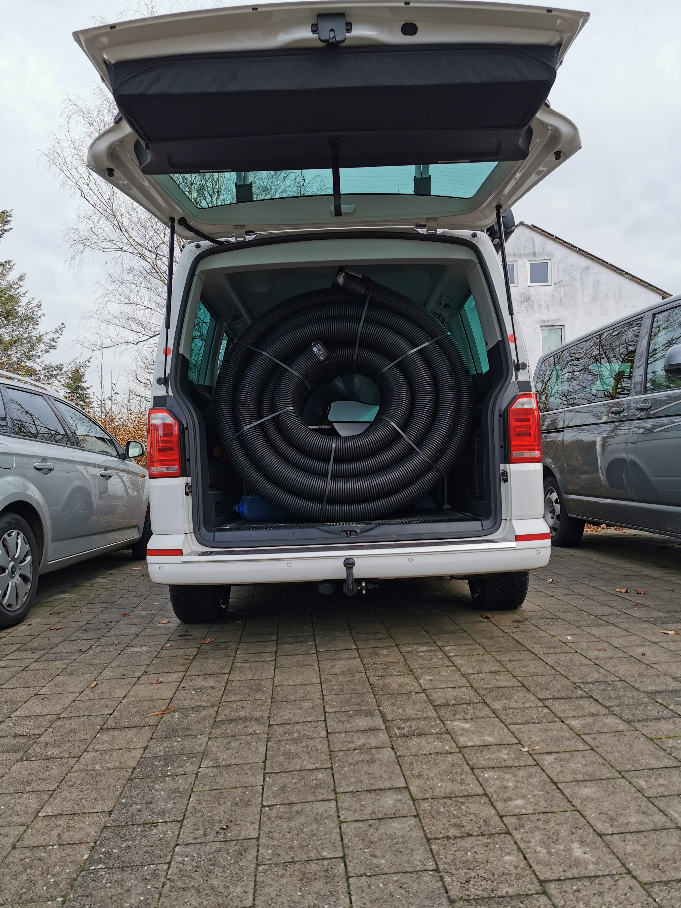
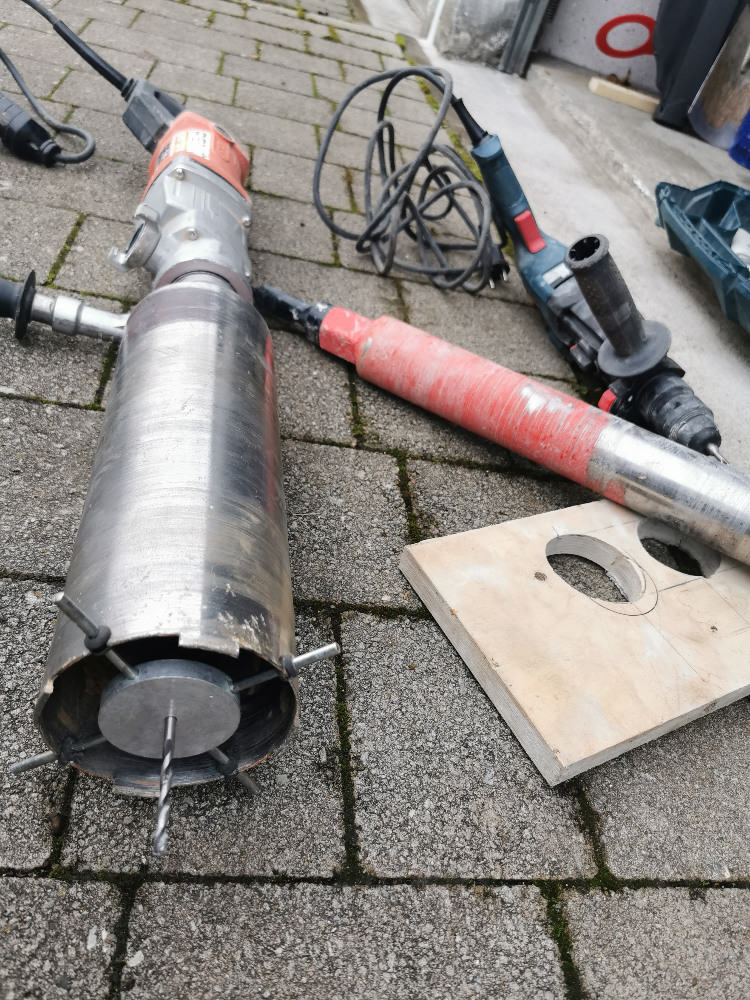

Zur Kostenoptimierung hatten wir uns entscheiden ein paar Arbeiten im Garagenhof zur Elektrifizierung selbst zu machen. Grabungen, vorbereitende Arbeiten wie die Montage der Kabelhalterungen hinten-oben in den Garagen und die Kern-Bohrungen seitlich durch alle Garagen haben wir uns selbst zugetraut. Die Verlegung der Leerrohre durch die Einfahrt und die Pflasterarbeiten haben wir beauftragt. Das war kaum ein Tag für die Profis mit dem Minibagger und die Fläche ist verdichtet und befahrbar wie vorher.

 Wir brauchten noch zwei Gräben von 70 cm Tiefe, ca. 3-4m Länge, 30 cm Breite um jeweils zwei Leerrohre darin verlegen zu können. Die Norm fordert 60 cm Überdeckung, eine Verlegung im Sand und darüber ein Warnband. (Kabuflex R 100 direkt vom örtlichen Baustoffhandel)

Im Dezember hatten wir schon einmal mit ca. sechs Mann fast einen Samstag die Gräben vorbereitet und erste Bohrungen in den Garagen gemacht. Größere Betonreste im Boden aus dem Garagenfundament haben uns noch zum Einsatz eines großen Abbruchmeißels gezwungen und uns ausgebremst. Da war dann auch der blaue Bosch Bohrhammer nur nutzloses Spielzeug… 

**Machen ist wie wollen – nur krasser**: Mit zehn Helfern haben wir dann gestern fast alle groben Arbeiten abschließen können:

- Wir haben die Gräben an der Strinseite – wo möglich wieder verfüllt, entsprechend mit Warnband ausgestattet
- Mit einer großen Kernbohrmaschine (Leihgerät von OBI für ca. 100€ / Tag) und deren Wasseranschluss konnten wir alle Bohrungen, Durchmesser 11cm in den Garagen fertigstellen.
- Bei den Garagen, durch die nur noch wenige Leitungen einzuziehen sind, haben wir pragmatisch 2,5 cm Löcher mit dem Bohrhammer gesetzt.
- Ebenso sind in fast allen Garagen die Kabeltrassen (verzinktes Lochblech, ca. 30cm tief und 3 cm hoch) auf feuerverzinkten Wandauslegern montiert worden. Eine Deckenmontage war uns zu heikel mit dem Flachdach der Garagen.
- Die 450m Erdverlegekabel 6x5mm² (NYY-J) auf zwei kleinen Rollen und etwas über 600 m CAT7 Netzwerkkabel für den LAN Anschluss der Wallboxen stehen auch sicher verstaut bereit.

Hier ein paar Eindrücke der Arbeiten und Co:

<figure markdown="span">
  { width="300" }
</figure>

<figure markdown="span">
  { width="300" }
</figure>

<figure markdown="span">
  { width="300" }
</figure>

Für die kleineren 6cm Löcher haben wir eine günstige Bohrkrone auf einem SDS Bohrhammer verwendet - ohne die Hammer-Einstellung natürlich. Auch nach mehreren Löchern durch den Beton der Fertiggaragen mit Wasserkühlung per Gloria-Spritze ist noch keine Abnutzung an den Diamantsegmenten messbar. 