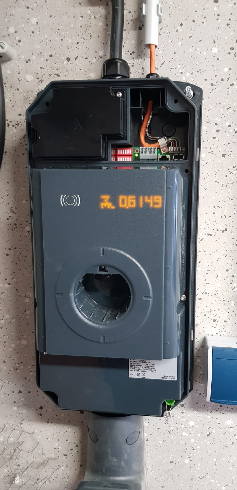

Die Auswahl einer Wallbox für den Garagenhof muss einige Randbedingungen erfüllen. Hier kurz unsere Hauptkriterien und auch für welches System wir uns entschieden haben.

- Integrierbar als Verbund mit **Lademanagement** bis zur maximalen Garagenanzahl.  
    Ihr habt 50, oder 80 A beim Stromanbieter bestellt und müsst sicher stellen, dass die Wallboxen in Summe nicht die Leistung überschreiten. Entweder lassen sie sich von außen durch ein zentrales Lastmanagement steuerm oder die Wallboxen sind bereits mit einem integrierten Lastmanagement über LAN oder ModBus ausgestattet.
- **Verfügbarkeit**, so dass auch eine hohe Chance besteht, dass Nachbarn, die erst später eine Wallbox installieren auch das System des Herstellers noch kaufen können. Hier hat man natürlich immer ein gewisses Risiko aber durch einen namenhaften, grossen Hersteller zumindest ein geringeres Risiko.
- Modelle, die es erlauben Ladevorgänge geeicht zu **dokumentieren** und zu exportieren, ggf sogar ein privat eKfZ und einen Firmenwagen voneinander getrenrnt zu laden und das dokumentiert zur Abrechnung mit dem Arbeitgeber zu exportieren. Die Unterscheidung mehrerer Fahrzeuge erfolgt oft per **RFID**. Ihr werdet aber auch Nachbarn haben, denen dieses Feature und der Aufpreis der Wallbox nicht wichtig ist. Eine Lösung, die im Verbund beides (RFID/Dokumentation vs einfachere Lösung) erlaubt ist somit dann das abgeleitete Ziel.
- **Qualität** und ggf Support – wenn ihr nur eine Wallbox bei Euch installiert ist das vielleicht nicht ganz so wichtig. Wenn Ihr aber ca. 15 Stück als System für die gesamte Nachbarschaft anschafft, dann ist ein Kontakt zum Hersteller zur Klärung Eurer Detailfragen sehr wertvoll.

## Unsere Auswahl: Keba P30-C und P30-X

Wir haben uns für das System von Keba entschieden. Die Keba Wallbox P30 der C-Serie erlaubt es, dass sich bis zu 15 Wallboxen durch eine Keba P30-X Wallbox in ein LAN zusammen schliessen und steuern lassen.

Ein paar Details aus unseren Rückfragen direkt beim Hersteller hier für Euch:

| Unsere Frage | Antwort von Keba |
|---|---|
| Kann die Keba P30-X auch 18 Wallboxen steuern? | Nein, die Anzahl der Clients ist auf 15 begrenzt.   Ohne Gewähr: Später 2022 ist ggf ein sog. Large Scale-Controler bis zu 256 oder mehr Clients (C-Serie) geplant. |
| Wenn manche Nachbarn die P30-C mit eichrechtskonformen Zähler &amp; RFID und andere die P30-C ohne, kann dann ein P30-X als Master diesen gemischten Verbund steuern? | Nein, dafür sind dann zwei LAN segmente und auch zwei P30-X Wallboxen nötig. Eine P30-x mit M&amp;E/RFID und eine ohne.   \*Das passte uns sogar noch, weil dan auf jeden Fall keine künstliche Begrenzung auf 15 mehr gegeben ist. |
| Die Wallboxen haben zwei Ethernet Anschlüsse. Einen Rj45 und einen LSA+ (direkte schneidklemme der Adern). Welcher ist denn nun zu verwenden? Müssen wir die RJ45 stecker aufcrimpen? | zum Anschluss im Verbund ist der LSA+ Anschluss zu verwenden. RJ45 ist vor allem als debug- Port vorhanden. Beide sind aber elektrisch parallel. Zum direkten Anschluss eines PCs muss man den Rj45 Stecker auf der Seite des Switch temporar abstecken.      \*Deshalb haben wir sternförmig in jede Garage ein CAT7 LAN Kabel verlegt und im Schaltschrank zwei kleine Switches um die zwei LAN segmente aufzubauen. |
| Wie kann man die Ladevorgänge exportieren? | Die P30-X hat einen Wlan Hotspot und webinterface und exportiert (x509/signierte) und geeichte Ladevorgänge.   Die Master-Box erlaubt den export der Ladevorgänge der angeschlossenen Clients für maximal 3 Monate. |

Es folgen später noch ein paar Details zur Nutzung der Wallbox für dynamisches Lastmanagement zusammen mit einem Siemens 7KM2200 Zähler. Dieser kann über Modbus oder TCP den aktuell gemessenen Gesamtstrom einer P30-X zu melden.

Die Installation der Walboxen mit Stockschrauben/Bohrschablone und der Anschluss verlief einwandfrei. Die Hotspot-Webseite der P30-x ist noch etwas langsam aber bisher ausreichend. Sobald wir den Verbund im LAN zusammen geschaltet haben folgt ein blogpost mit ein paar screenshots.

*Disclaimer: Wir bekommen keine Vergünstigung/Vorteile von Keba und sind nur ganz normaler Kunde. Heutzutage leider erwähnenswert…*

<figure markdown="span">
  { width="300" }
</figure>
