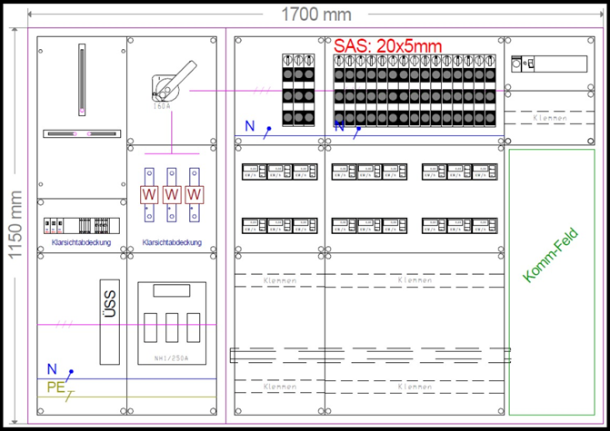
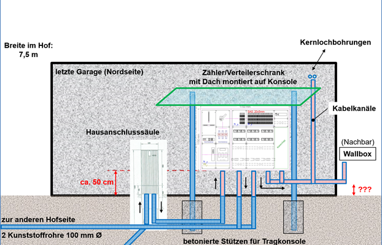
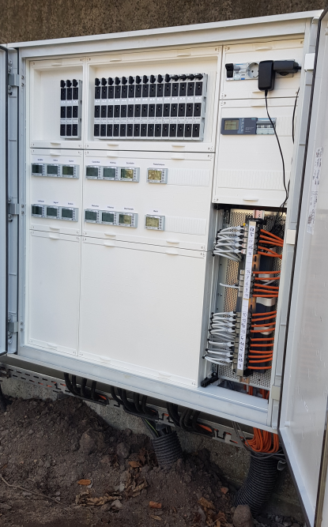
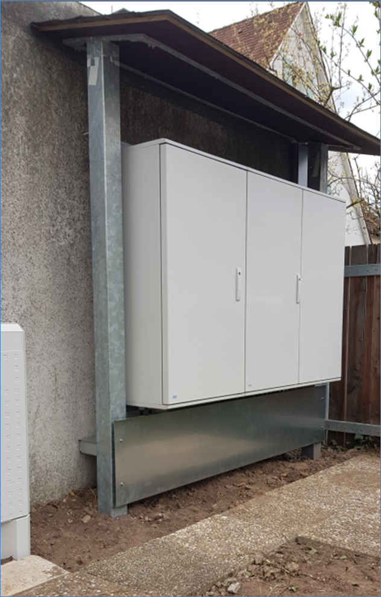

Hier jetzt mal ein Beitrag zum Aufbau unseres Schaltschrankes mit der Unterverteilung, ein paar Details zu den Zählern und der Vernetzung.

Wichtig waren uns folgende Anforderungen:

- Nur einen Zähler zum Stromversorger, weil an diesem ja der monatliche Beitrag hängt
- Ablesen aller Wallboxen an einer zentralen Stelle, ohne in jede Garage gehen zu müssen.
- Anfangs Leistung von 50A pro Phase, jedoch Erweiterungsmöglichkeit bis 160 A durch Austausch der entsprechenden Sicherungen.
- Reservierte Leerplätze für wirklich alle Nachbarn die vielleicht noch später in ein paar Jahren ebenfalls Strom in Ihrer Garage möchten.

Der erste Entwurf zeigt unten die Hauptsicherungen (bis zu 250 A möglich). Die drei „W“ darüber sind die Spulen um die Stromschienen für die Wandlermessung und darüber den Hauptschalter von dem aus die Phasen nach rechts zu den Sicherungen pro Garage führen. Links vom Hauptschalter ist der Platz für den Zähler. Unterhalb der Sicherungen befindet sich für jede Garage ein digitaler 3-Phasenzähler und darunter das Anschlussfeld um von den Garagenzählern auf die 5x6mm² Kabel zu gehen.

Links oben befindet sich noch ein kleines Feld zur Stromversorgung der Ethernet switches darunter. Im Bereich „Kommunikationsfeld“ laufen die CAT7 Kabel zusammen und ermöglichen den Wallboxen das Lastmanagement. Zur Klarstellung: Den Schaltschrank haben wir von einer professionellen Elektrofachfirma bestücken und aufbauen lassen. Jedoch waren wir an der Planung der Montage des Schrankes und einiger Details wie den Anschlüssen der Leerrohre oder der Ethernet-Vernetzung beteiligt.

<figure markdown="span">
  { width="300" }
</figure>
Hier die schematische Darstellung des Schaltschrankes mit den Haupt-Leerrohren und dem Hausanschlusskasten daneben. So ein Bild hilft ungemein um den Überblick zu behalten.

<figure markdown="span">
  { width="300" }
</figure>

Jetzt noch ein paar Bilder wie der Schaltschrank dann fertig aussieht:

<figure markdown="span">
  { width="300" }
</figure>

<figure markdown="span">
  { width="300" }
</figure>

<figure markdown="span">
  { width="300" }
</figure>
