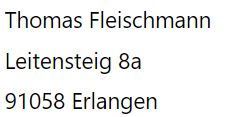

# Impressum 

Email: flyingcars  (at) quarterbit (punkt) de
Telefon: null eins sechs null – acht zwo vier acht acht sieben eins

<figure markdown="span">
  { width="300" }
</figure>

Der Nutzung von im Rahmen der Impressumspflicht veröffentlichten Kontaktdaten durch Dritte zur Übersendung von nicht ausdrücklich angeforderter Werbung und Informationsmaterialien wird hiermit ausdrücklich widersprochen. Wir behalten uns ausdrücklich rechtliche Schritte im Falle der unverlangten Zusendung von Werbeinformationen, etwa durch Spam-Mails, vor.

## Datenschutzerklärung

Der Webserver schreibt Logdateien mit den Zugriffen und den IP-Adressen der Zugreifer. Zu den Zugriffsdaten gehören: Name der abgerufenen Webseite, Datei, Datum, Uhrzeit und Verweildauer des Abrufs, übertragene Datenmenge, Meldung über erfolgreichen Abruf, Browsertyp nebst Version, das Betriebssystem des Nutzers, Referrer URL (die zuvor besuchte Seite), IP-Adresse und der anfragende Provider. Wir verwenden die Protokolldaten nur für statistische Auswertungen zum Zweck des Betriebs, der Sicherheit und der Optimierung des Angebotes. Ich behalte mir jedoch vor, die Protokolldaten nachträglich zu überprüfen, wenn aufgrund konkreter Anhaltspunkte der berechtigte Verdacht einer rechtswidrigen Nutzung besteht.

Die Nutzung der Webseite ist in der Regel ohne Angabe personenbezogener Daten möglich. Soweit auf dieser Seiten personenbezogene Daten (beispielsweise Name, Anschrift oder eMail-Adressen) erhoben werden, erfolgt dies, soweit möglich, stets auf freiwilliger Basis. Diese Daten werden ohne Ihre ausdrückliche Zustimmung nicht an Dritte weitergegeben. Ich weise darauf hin, dass die Datenübertragung im Internet (z.B. bei der Kommunikation per E-Mail) Sicherheitslücken aufweisen kann. Ein lückenloser Schutz der Daten vor dem Zugriff durch Dritte ist nicht möglich.

Abgesehen davon werden keine Daten erhoben, gespeichert oder ausgewertet.

# Geltungsbereich

Diese Datenschutzerklärung klärt Nutzer über die Art, den Umfang und Zwecke der Erhebung und Verwendung personenbezogener Daten durch den verantwortlichen Anbieter (siehe Impressum) auf dieser Website (im folgenden “Angebot”) auf. Die rechtlichen Grundlagen des Datenschutzes finden sich im Bundesdatenschutzgesetz (BDSG) und dem Telemediengesetz (TMG).

# Kontaktaufnahme
Bei der Kontaktaufnahme mit mir (zum Beispiel per Kontaktformular, E-Mail, Telefon oder Fax) werden die Angaben des Nutzers und die durch die Nutzung übertragenen Daten zwecks Bearbeitung der Anfrage sowie für den Fall, dass Anschlussfragen entstehen, gespeichert.

# Einbindung von Diensten und Inhalten Dritter
Es kann vorkommen, dass innerhalb dieses Onlineangebotes Inhalte Dritter, wie zum Beispiel Videos von YouTube, Kartenmaterial von Google-Maps, RSS-Feeds oder Grafiken von anderen Webseiten eingebunden werden. Dies setzt immer voraus, dass die Anbieter dieser Inhalte (nachfolgend bezeichnet als „Dritt-Anbieter“) die IP-Adresse der Nutzer wahr nehmen. Denn ohne die IP-Adresse, könnten sie die Inhalte nicht an den Browser des jeweiligen Nutzers senden. Die IP-Adresse ist damit für die Darstellung dieser Inhalte erforderlich. Wir bemühen uns nur solche Inhalte zu verwenden, deren jeweilige Anbieter die IP-Adresse lediglich zur Auslieferung der Inhalte verwenden. Jedoch haben wir keinen Einfluss darauf, falls die Dritt-Anbieter die IP-Adresse z.B. für statistische Zwecke speichern. Soweit dies uns bekannt ist, klären wir die Nutzer darüber im Folgenden auf.

# Cookies
Cookies sind kleine Dateien, die es ermöglichen, auf dem Zugriffsgerät der Nutzer (PC, Smartphone o.ä.) spezifische, auf das Gerät bezogene Informationen zu speichern. Sie dienen zum einem der Benutzerfreundlichkeit von Webseiten und damit den Nutzern (z.B. Speicherung von Logindaten). Zum anderen dienen sie, um die statistische Daten der Webseitennutzung zu erfassen und sie zwecks Verbesserung des Angebotes analysieren zu können. Die Nutzer können auf den Einsatz der Cookies Einfluss nehmen. Die meisten Browser verfügen über eine Option mit der das Speichern von Cookies eingeschränkt oder komplett verhindert wird. Allerdings kann dadurch die Nutzung und insbesondere der Nutzungskomfort ohne Cookies eingeschränkt werden. Sie können viele Online-Anzeigen-Cookies von Unternehmen über die US-amerikanische Seite http://www.aboutads.info/choices/ oder die EU-Seite http://www.youronlinechoices.com/uk/your-ad-choices/ verwalten.

# Auskunft, Löschung, Sperrung
Sie haben jederzeit das Recht auf unentgeltliche Auskunft über Ihre gespeicherten personenbezogenen Daten, deren Herkunft und Empfänger und den Zweck der Datenverarbeitung sowie ein Recht auf Berichtigung, Sperrung oder Löschung dieser Daten. Hierzu sowie zu weiteren Fragen zum Thema personenbezogene Daten können Sie sich jederzeit über die im Impressum angegebene Adresse an mich wenden

